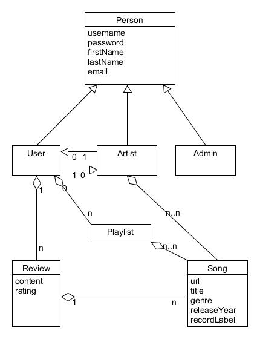

# CS WebDev 5610

Hello, my name is Jason Cutler.  I'm a CS grad student at the Seattle campus 
of Northeastern University. This repository contains my source code for the 
class project of CS 5610 - Web Development (Summer 2017).

## Project Description

This application will allow anonymous listeners to access songs posted by artists, 
and registered users to create playlists and reviews of songs.

### Potential Domain Objects
* Songs
	* Includes artist, release year (if available), record label (if available)
	  and broad musical genre (classical, rock, pop, etc.)
* Reviews
	* Posted by registered users.  Each song can have many reviews. Includes a 
	  numerical rating (0.0 - 5.0), optional textual content, and the user posting
	  the review.
* Playlists
	* Created by individual registered users and comprised of songs

### Potential Human Roles
* Admin
	1) Perform CRUD operations on registered users, artists
	2) Perform CRUD operations on songs, reviews, and playlists
* Anonymous
	1) Able to listen to songs and read reviews
* Registered User
	1) Able to listen to songs
	2) Able to perform CRUD operations on reviews
	3) Able to perform CRUD operations on playlists
* Artist
	1) Able to perform CRUD operations on songs
  
  ### Data Model
  
  
  ### Proof of Concept
  
